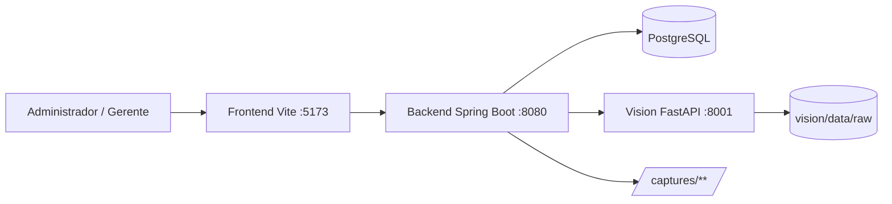
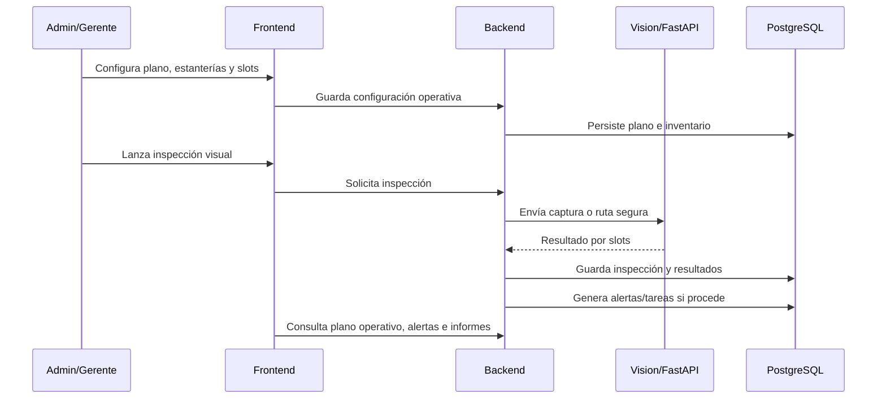
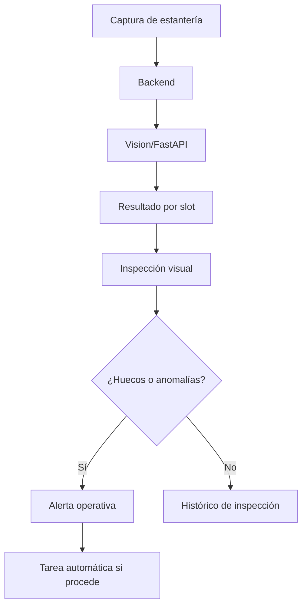
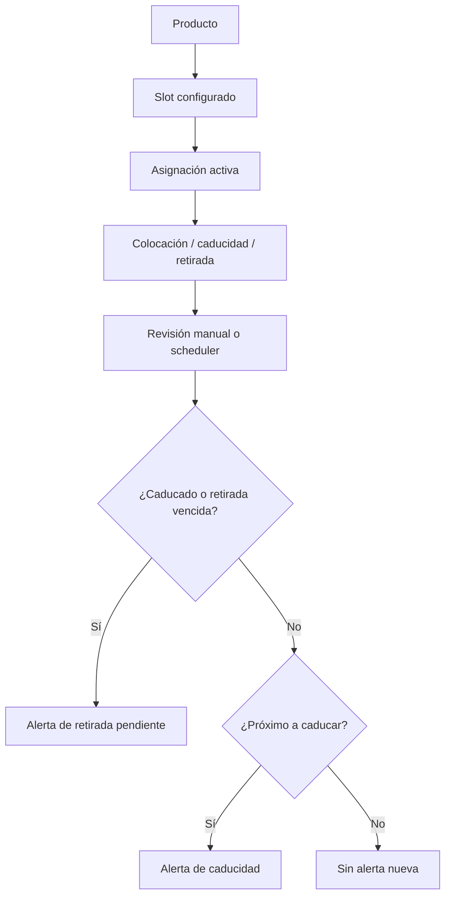
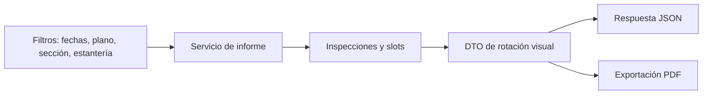

# EstanterIA — Gestión operativa de estanterías con visión artificial

Sistema web para supervisar estanterías mediante planos 2D, visión artificial, inventario operativo, alertas, tareas, informes y equipo de trabajo.


## 1. Objetivo

EstanterIA es una aplicación operativa para gestionar el estado de estanterías físicas desde un panel web administrativo.

- Configurar empresas, secciones, estanterías, slots y productos esperados.
- Visualizar planos 2D operativos con zonas, estanterías y estado visual de slots.
- Ejecutar inspecciones visuales con apoyo de un servicio Vision/FastAPI.
- Registrar inspecciones manuales y asociar capturas como evidencia.
- Generar alertas y tareas operativas a partir de inspecciones, caducidades y disponibilidad de trabajadores.
- Gestionar inventario mediante asignaciones activas, fechas de colocación, caducidad y retirada programada.
- Gestionar equipo operativo, disponibilidad y trabajadores asignados a estanterías.
- Consultar informes de rotación visual y vaciados detectados en formato JSON/PDF.

## 2. Estado actual

La versión actual es un MVP funcional / v0.5.

El backend, el frontend y el servicio de Vision están integrados. El panel web principal está reservado a perfiles `ADMIN` y `SUPERADMIN`; el rol `WORKER` se mantiene para trazabilidad, tareas, permisos y una futura interfaz operativa separada.

La versión actual permite ejecutar el flujo principal: configurar un plano, asociar estanterías y productos, lanzar inspecciones, generar alertas/tareas, gestionar trabajadores y consultar informes operativos.

## 3. Stack tecnológico

| Capa | Tecnología | Uso |
|---|---|---|
| Backend | Java 17 + Spring Boot | API REST, seguridad y reglas operativas |
| Seguridad | Spring Security + JWT | Login, roles y sesiones |
| Persistencia | PostgreSQL + JPA/Hibernate | Modelo operativo e histórico |
| Frontend | HTML/CSS/TypeScript + Vite | Panel web administrativo |
| Vision | Python + FastAPI + YOLO/Ultralytics | Análisis visual de capturas |
| Documentación API | Swagger/OpenAPI | Exploración de endpoints |
| API testing | Postman | Pruebas manuales |
| Testing | JUnit 5 + H2 | Tests backend |

## 4. Arquitectura general



Resumen de responsabilidades:

- `frontend/`: panel administrativo, vistas HTML, estilos CSS y lógica TypeScript.
- `backend/`: API REST, autenticación, reglas operativas, persistencia, informes y PDF.
- `vision/`: servicio Python para inferencia visual y normalización de capturas.
- `docs/`: notas de API y colección Postman.

## 5. Módulos principales

### 5.1. Autenticación y perfil

- Login con JWT.
- Sesiones revocables mediante backend.
- Recuperación de contraseña por correo.
- Perfil de cuenta autenticada.
- Panel web principal reservado a `ADMIN` y `SUPERADMIN`.

### 5.2. Planos 2D

- Planos activos e inactivos mediante baja lógica.
- Zonas del plano asociadas a secciones operativas.
- Estanterías colocadas sobre el plano.
- Visualización del estado por slot.
- Alertas y tareas visibles desde el contexto del plano.

### 5.3. Editor de planos

- Creación y edición de planos persistentes.
- Añadido de zonas y estanterías.
- Configuración de slots y productos esperados.
- Asignación de trabajadores a estanterías.
- Guardado del layout operativo.

### 5.4. Vision e inspecciones

- Servicio externo FastAPI para análisis visual.
- Capturas asociadas a estanterías.
- Inspecciones visuales con resultado por slot.
- Inspecciones manuales para registrar estado operativo sin inferencia.
- Edición de imagen asociada a una inspección existente.

### 5.5. Inventario operativo

- Gestión de productos.
- Indicador de stock demo.
- Producto esperado por slot.
- Asignaciones activas de producto en slot.
- Fechas de colocación, caducidad y retirada programada.

### 5.6. Alertas y tareas

- Alertas visuales por huecos o anomalías detectadas.
- Alertas de caducidad y retirada programada.
- Alertas por trabajadores no disponibles asignados.
- Tareas automáticas y manuales.
- Reapertura de tareas finalizadas cuando procede.

### 5.7. Equipo operativo

- Gestión de trabajadores.
- Disponibilidad: disponible, ausente o enfermo.
- Baja lógica mediante activo/inactivo.
- Asignación de trabajadores a estanterías.

### 5.8. Informes

- Informe de rotación visual.
- Productos con más vacíos detectados.
- Productos sin vacíos detectados.
- Exportación PDF desde el mismo resultado operativo que el JSON.
- El informe no mide ventas reales; resume vaciados visuales detectados en inspecciones.

## 6. Flujo operativo principal



## 7. Flujos funcionales clave

### 7.1. Vision -> Inspección -> Alertas -> Tareas



La inspección visual no modifica el inventario activo ni crea ventas. Su objetivo es registrar evidencia, estado visual por slot y alertas operativas cuando el resultado lo requiere.

### 7.2. Inventario -> Asignación activa -> Caducidad -> Alerta



Las revisiones de caducidad crean alertas reales y evitan duplicar alertas abiertas equivalentes. La retirada de una asignación conserva el histórico operativo.

### 7.3. Informes -> JSON/PDF



El PDF reutiliza el mismo DTO que el informe JSON para evitar métricas divergentes entre formatos. Los filtros opcionales se tratan de forma explícita para mantener compatibilidad con PostgreSQL.

## 8. Patrones y decisiones técnicas

El proyecto prioriza una arquitectura sencilla y trazable: controladores ligeros, reglas en servicios y DTOs para separar el contrato REST del modelo JPA.

### 8.1. Strategy

El acceso a Vision se abstrae mediante `VisionResultadoProvider`, con implementaciones real/simulada seleccionables por configuración.

Esto permite alternar entre el proveedor HTTP/FastAPI y un proveedor simulado sin acoplar la lógica de inspecciones al origen concreto del resultado visual.

### 8.2. Adapter

`VisionClient` actúa como adaptador entre Spring Boot y el servicio FastAPI.

Encapsula detalles HTTP externos, rutas de capturas y errores de integración para que los servicios de inspección trabajen con respuestas normalizadas.

### 8.3. Service Layer

Los servicios concentran las reglas operativas principales:

- `ModeloOperativoService`
- `AlertaOperativaService`
- `TareaOperativaService`
- `PlanoOperativoService`
- `InformeRotacionVisualService`

La intención es evitar controladores con lógica compleja y mantener las decisiones de negocio en clases testeables.

### 8.4. Repository

Spring Data JPA se usa para el acceso a persistencia y consultas específicas de planos, inspecciones, informes, tareas, alertas y entidades operativas.

Las consultas críticas para informes evitan filtros opcionales problemáticos con PostgreSQL y separan casos con/sin parámetros cuando aporta claridad.

### 8.5. DTO / Assembler

Las entidades JPA no se exponen directamente en la API.

Las respuestas REST usan DTOs y ensambladores de respuesta para construir vistas operativas complejas, especialmente en planos, informes, alertas, tareas e inventario.

### 8.6. Scheduler / Job

`CaducidadAsignacionesScheduler` revisa periódicamente caducidades y retiradas programadas.

La revisión programada reutiliza la misma lógica que la revisión manual para no duplicar reglas ni generar prioridades divergentes.

### 8.7. Builder

Las respuestas de error estructuradas se construyen con un enfoque tipo builder cuando aporta claridad, por ejemplo en `ApiErrorResponse`.

## 9. Patrones evaluados

Se evaluó Decorator para enriquecer respuestas operativas, pero se descartó porque el diseño actual encaja mejor con servicios ensambladores y DTOs. Implementarlo habría añadido complejidad sin beneficio claro.

La creación de tareas automáticas desde alertas podría extraerse en el futuro a una Factory/Policy si crece el número de tipos de alerta y reglas asociadas.

## 10. Baja lógica e histórico operativo

El proyecto evita el borrado físico en entidades operativas relevantes. Productos, secciones, estanterías, planos y trabajadores se desactivan/reactivan cuando aplica.

Esto permite:

- conservar inspecciones, alertas, tareas, layouts e histórico;
- evitar pérdida de trazabilidad;
- ocultar entidades inactivas de flujos operativos por defecto;
- reactivar elementos desde vistas administrativas cuando el flujo lo permite.

Ejemplos:

- un plano inactivo no aparece por defecto en Home/Informes, pero conserva zonas y layouts;
- una estantería inactiva conserva inspecciones y alertas históricas;
- un producto inactivo no aparece para nuevas asignaciones;
- un trabajador ausente, enfermo o inactivo no debe usarse para nuevas asignaciones operativas.

## 11. Seguridad y datos sensibles

- La API usa JWT para autenticar peticiones privadas.
- Las páginas privadas tienen guards frontend para mejorar experiencia de usuario.
- El backend protege endpoints por rol y sigue siendo la autoridad de seguridad.
- No se deben subir `.env`, credenciales reales, dumps privados ni tokens.
- No se deben compartir backups completos si contienen sesiones o tokens de recuperación.

Tablas especialmente sensibles:

- `auth_session`
- `password_reset_token`
- `user_account`

Los backups completos de PostgreSQL pueden contener sesiones, tokens de recuperación y hashes de usuario. No deben subirse dumps completos a repositorios públicos.

Para compartir una copia demo se recomienda:

- usar `--no-owner --no-privileges` para hacer el dump más portable;
- excluir datos de `auth_session` y `password_reset_token`;
- revisar si procede regenerar o limpiar usuarios de `user_account`.

## 12. Backup de base de datos

### 12.1. Backup privado completo

Adecuado solo para uso local/privado. Puede incluir sesiones, tokens e información sensible.

```powershell
$desktop = [Environment]::GetFolderPath("Desktop")

D:\PSQL\bin\pg_dump.exe -h localhost -p 5432 -U postgres -d estanteria -F c -v -f "$desktop\estanteria_backup_privado.dump"
```

### 12.2. Backup demo portable

Pensado para compartir datos demo evitando sesiones y tokens de recuperación. Usa `--no-owner --no-privileges` para reducir dependencias del rol local de PostgreSQL.

```powershell
$desktop = [Environment]::GetFolderPath("Desktop")

D:\PSQL\bin\pg_dump.exe -h localhost -p 5432 -U postgres -d estanteria --no-owner --no-privileges --exclude-table-data=public.auth_session --exclude-table-data=public.password_reset_token -F p -v -f "$desktop\estanteria_backup_demo.sql"
```

Antes de publicar o entregar un backup demo conviene revisar que no incluya credenciales reales, correos personales ni datos sensibles. No se recomienda subir dumps privados completos al repositorio.

## 13. Alcance y limitaciones

Incluido en esta versión:

- panel web administrativo;
- planos 2D operativos;
- editor de planos;
- inventario por asignaciones activas;
- inspecciones manuales y visuales;
- alertas y tareas operativas;
- equipo operativo;
- informes JSON/PDF;
- integración con Vision/FastAPI.

Fuera de alcance actual:

- la web principal está orientada a `ADMIN` y `SUPERADMIN`;
- `WORKER` queda reservado para futuras interfaces operativas;
- Vision depende de capturas disponibles y de la configuración del modelo;
- no hay stock numérico ni pedidos automáticos;
- no hay nóminas, horarios ni gestión laboral avanzada;
- no hay ventas reales ni cálculo de ingresos;
- la generación PDF de informes usa tablas simples, no gráficas complejas;
- para producción real, las migraciones de base de datos deberían formalizarse con Flyway/Liquibase.

## 14. Roadmap

### 14.1. Corto plazo / cierre

- Documentación final.
- Revisión visual manual final.
- Completar guía de demo funcional con capturas.
- Preparar backup demo sanitizado.
- Revisar evidencias de Swagger/Postman para la memoria.

### 14.2. Post-v0.5

- App/interfaz específica para `WORKER`.
- Stock numérico y pedidos.
- Notificaciones.
- Exportaciones adicionales.
- Migraciones formales con Flyway/Liquibase.
- Mejora de informes con más filtros/gráficas.
- Factory/Policy para tareas automáticas si crecen las reglas.

## 15. Nota sobre informes y ventas reales

El informe de rotación visual analiza vacíos detectados en inspecciones.

No mide ventas reales, no calcula precios, ingresos ni rentabilidad. Sirve como apoyo operativo para identificar productos o slots con vaciados recurrentes y productos sin vacíos detectados.

El informe debe interpretarse como rotación visual estimada, no como informe comercial de ventas.

## 16. Roles y permisos

| Rol | Uso actual |
|---|---|
| `SUPERADMIN` | Administración completa del sistema y operaciones avanzadas |
| `ADMIN` | Gestión operativa del panel web |
| `WORKER` | Trazabilidad de tareas y futuras interfaces operativas |

El frontend principal se reserva para `ADMIN` y `SUPERADMIN`. El backend sigue validando permisos en endpoints privados, por lo que el control de acceso no depende solo de ocultar botones en la interfaz.

## 17. Usuarios demo

Si el seed demo está activo, las credenciales esperadas son:

| Rol | Email | Password | Acceso |
|---|---|---|---|
| ADMIN | `admin@example.com` | `admin123` | Panel web principal |
| SUPERADMIN | `superadmin@example.com` | `superadmin123` | Panel web principal |
| WORKER | `worker@example.com` | `worker123` | Acceso restringido / futura interfaz operativa |

El panel web está pensado para administración y gerencia. Los trabajadores se usan dentro del modelo operativo para asignaciones, tareas, disponibilidad y validación de permisos.

## 18. Ejecución local

### 18.1. Requisitos

- Java 17 o superior.
- Maven.
- Node.js y npm.
- Python 3.12 recomendado para `vision/`.
- PostgreSQL en local.

### 18.2. Base de datos

Configuración por defecto del backend:

```properties
spring.datasource.url=jdbc:postgresql://localhost:5432/estanteria
spring.datasource.username=estanteria_user
spring.datasource.password=estanteria_password
```

El backend usa `spring.jpa.hibernate.ddl-auto=update` para entorno local/demo.

### 18.3. Backend

```bash
cd backend
mvn spring-boot:run
```

Backend esperado:

- API: `http://localhost:8080`
- Swagger UI: `http://localhost:8080/swagger-ui.html`
- OpenAPI JSON: `http://localhost:8080/v3/api-docs`

### 18.4. Frontend

```bash
cd frontend
npm install
npm run dev
```

Frontend esperado:

- `http://localhost:5173`

### 18.5. Vision

```bash
cd vision
python -m venv .venv
.\.venv\Scripts\activate
pip install -r requirements.txt
python -m uvicorn app.api:app --host 127.0.0.1 --port 8001 --reload
```

Vision esperado:

- API: `http://127.0.0.1:8001`
- Health: `http://127.0.0.1:8001/health`

## 19. Scripts y comandos útiles

Backend:

```bash
cd backend
mvn spring-boot:run
```

Frontend:

```bash
cd frontend
npm run dev
npm run build
npm exec tsc -- --noEmit
npm run preview
```

Vision:

```bash
cd vision
python -m uvicorn app.api:app --host 127.0.0.1 --port 8001 --reload
```

## 20. Configuración importante

Variables y propiedades relevantes:

| Configuración | Uso |
|---|---|
| `JWT_SECRET` | Secreto para firmar tokens JWT |
| `MAIL_USERNAME` / `MAIL_APP_PASSWORD` | Recuperación de contraseña por correo |
| `vision.api.base-url` | URL del servicio Vision/FastAPI |
| `app.demo.seed.enabled` | Activa datos demo |
| `app.demo.seed.reset-passwords` | Restaura passwords demo si se activa temporalmente |
| `app.alertas.caducidad.dias-anticipacion` | Ventana de aviso de caducidad |
| `app.alertas.caducidad.scheduler.enabled` | Activa revisión programada de caducidades |

Vision dispone de ejemplo en `vision/.env.example`:

```properties
MODEL_PATH=models/entrenados/best.pt
MODEL_VERSION=slot-classifier-v1
CONFIDENCE_THRESHOLD=0.25
API_HOST=127.0.0.1
API_PORT=8001
```

## 21. Capturas e imágenes

El proyecto contiene recursos visuales base en:

- `frontend/img/`
- `vision/data/`
- rutas públicas servidas por backend bajo `/captures/**`

Capturas recomendadas para documentación ampliada:

- Home operativo.
- Plano operativo 2D.
- Editor de planos.
- Inventario y asignación activa.
- Inspecciones y detalle visual.
- Alertas y tareas.
- Informes JSON/PDF.

## 22. API, Swagger y Postman

Swagger/OpenAPI:

- Swagger UI: `http://localhost:8080/swagger-ui.html`
- Swagger UI alternativa: `http://localhost:8080/swagger-ui/index.html`
- OpenAPI JSON: `http://localhost:8080/v3/api-docs`

Postman:

- Colección: `docs/postman/EstanterIA.postman_collection.json`
- Entorno local: `docs/postman/EstanterIA.local.postman_environment.json`

Flujo recomendado:

1. Ejecutar `POST /api/login`.
2. Copiar el token JWT.
3. Usar `Authorization: Bearer <token>` en Swagger o Postman.
4. Probar endpoints privados con usuario `ADMIN` o `SUPERADMIN`.

Notas ampliadas de API:

- `docs/API_NOTES.md`

## 23. Testing y validación

Backend:

```bash
cd backend
mvn clean compile
mvn test
```

Frontend:

```bash
cd frontend
npm run build
npm exec tsc -- --noEmit
```

La QA funcional del proyecto se apoya además en Swagger, Postman y revisión manual de los flujos principales: planos, editor, inventario, inspecciones, alertas, tareas, equipo e informes.

## 24. Estructura del proyecto

```text
estanteria/
├── backend/
│   ├── src/main/java/...       # API REST, servicios, seguridad y persistencia
│   ├── src/main/resources/     # configuración, templates y seed demo
│   └── src/test/               # tests backend con JUnit/H2
├── frontend/
│   ├── html/                   # páginas del panel web
│   ├── css/                    # estilos visuales
│   └── src/                    # TypeScript por página y servicios API
├── vision/
│   ├── app/                    # FastAPI, inferencia y esquemas
│   ├── data/                   # capturas/datos locales de visión
│   └── requirements.txt
├── docs/
│   ├── API_NOTES.md
│   └── postman/
└── README.md
```

## 25. Documentación ampliada

Documentación incluida:

- `docs/API_NOTES.md`: Swagger, Postman, permisos básicos y orden recomendado de pruebas.
- `docs/postman/EstanterIA.postman_collection.json`: colección Postman local.
- `docs/postman/EstanterIA.local.postman_environment.json`: variables de entorno Postman.

Pendiente para siguientes iteraciones:

- Guía de demo funcional.
- Diagramas de dominio.
- Descripción completa de flujos operativos.
- Capturas finales para memoria.
- Tabla resumida de endpoints principales.
- `DECISIONS.md`, `ROADMAP.md`, `DEVLOG.md` o `CHANGELOG.md` solo se enlazarán cuando existan para evitar enlaces rotos.

Para la memoria final se recomienda complementar este README con capturas de Swagger, flujos de uso y evidencia de pruebas.

## 26. Autor

Proyecto desarrollado como Proyecto Fin de Curso.
